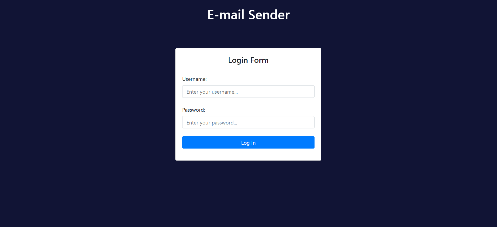
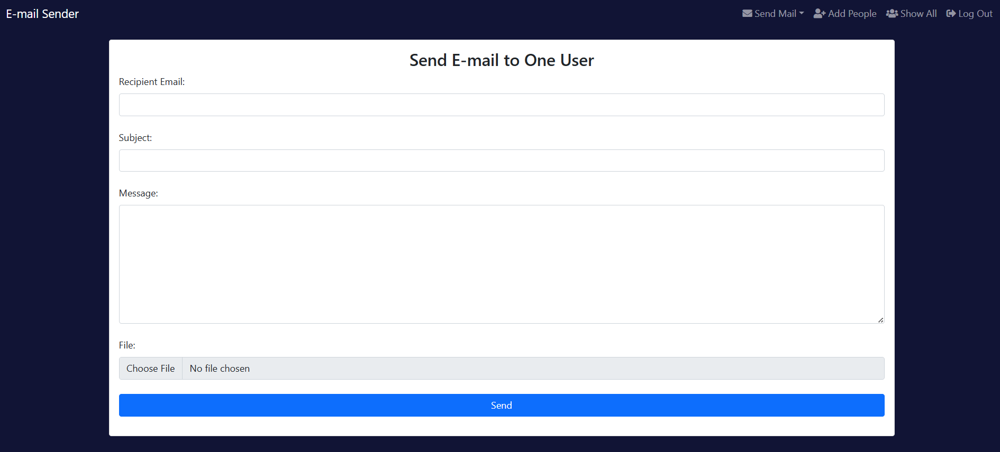
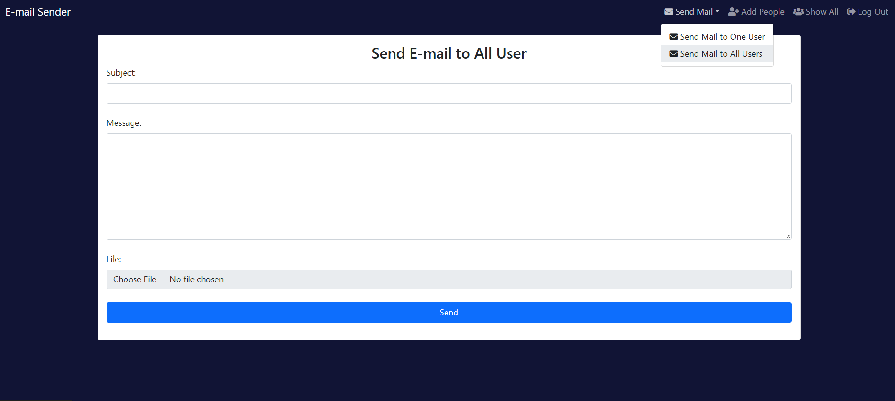
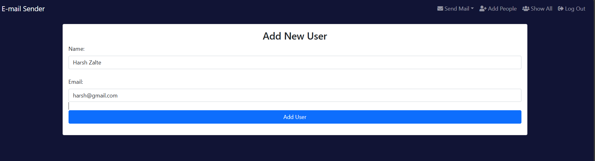
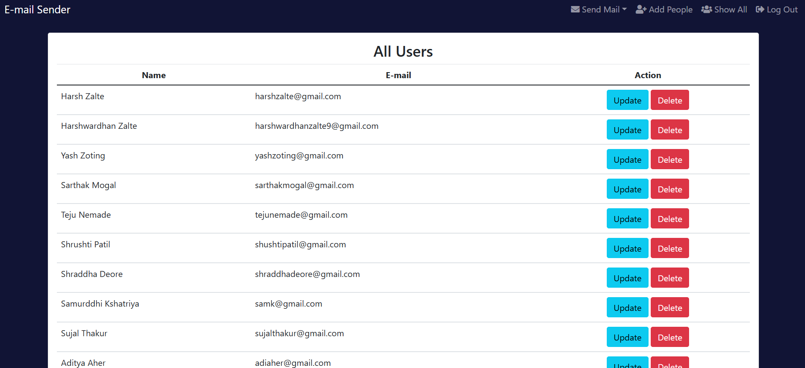

# Email Sending Application
---
Build Using
  - HTML
  - CSS
  - JS
  - Python
  - Django
---
## Output

Login

Mail To One User

Mail To All Users

ADD Users

Display, Update and Delete All Users

---

For Login
  Username: admin
  Password: admin
